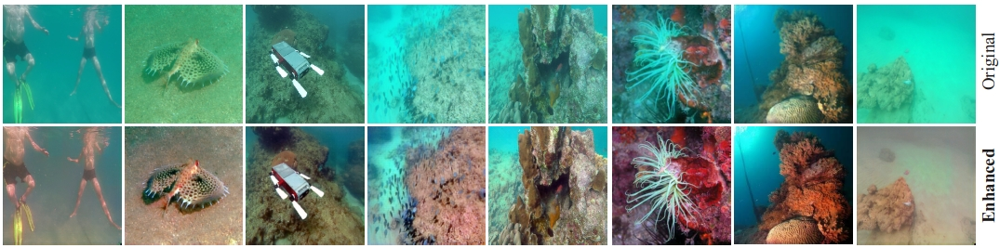

#### Resources
- Implementations of **[FUnIE-GAN](https://ieeexplore.ieee.org/document/9001231)** for underwater image enhancement
- Simplified implementations of **[UGAN](https://ieeexplore.ieee.org/document/8460552)** and its variants ([original repo](https://github.com/cameronfabbri/Underwater-Color-Correction))
- Implementation: TensorFlow >= 1.11.0 and Keras >= 2.2 (Python 2.7)

#### Usage
- Download the data, setup data-paths in the training-scripts
- Use paired training for FUnIE-GAN / UGAN, and unpaired training for FUnIE-GAN-up 
- A few saved models are provided in models/
- Use the test-scripts for evaluating different models

#### Acknowledgements
- https://github.com/floodsung/Deep-Learning-Papers-Reading-Roadmap
- https://github.com/PacktPublishing/Advanced-Deep-Learning-with-Keras
- https://github.com/cameronfabbri/Underwater-Color-Correction
- https://github.com/eriklindernoren/Keras-GAN
- https://github.com/phillipi/pix2pix
- https://github.com/wandb/superres
